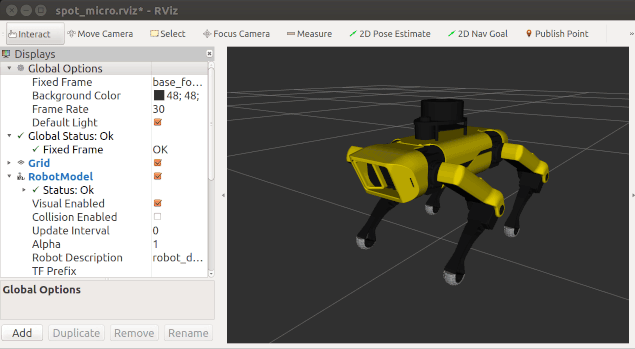

# Embedded DevSecOps Demo

## Documentation

Comprehensive documentation for this repo can be found in the [github pages](https://cprime-labs.github.io/edo-demo/) website hosted within this repo.

## Project Brief

Create a swarm of 3 autonomous robots based upon the open source robot [Spotmicro](https://www.thingiverse.com/thing:3445283).

## Project Management

Tasks and issues that relate to development of this repo can be found in this repo's [project board](https://github.com/orgs/cprime-labs/projects/2/views/1).

## How to use this repo

Follow these steps to fully implement this repo:

### Step 0: GitHub.

If you are viewing this readme by any other means go to the canonical repository on [GitHub](https://github.com/cprime-labs/edo-demo) for the most up to date version of this repo.

### Step 1: Launch Codespaces.

* On the home page for this repo, select the branch you want to base your work on then click the '<> Code' dropdown. Select the codespaces tab and select 'Create codespace in the secondary menu on the branch you want to work on.
* Codespaces will now launch.

### Step 3: Run the tests.

* From the command prompt in the project root of this repo, execute the following command.
* `make bazel/test`

### Step 5: Eat, Sleep, Code, Repeat!

* Create a local working branch for whatever feature you are working on.
* Run local tests to ensure you won't push a breaking build.
* Push your branch to origin to trigger an automated CI build.
* If the automated CI build passed, create a pull request to have your code merged to the master branch.
* Rinse and repeat! Happy coding :)

## Tooling

The following tools are not strictly required to work with this repo but we recommend their use and used them oursleves in the creation of this repo:

* [GitHub](https://GitHub.com): GitHub, Inc. is a provider of Internet hosting for software development and version control using Git. It offers the distributed version control and source code management functionality of Git, plus its own features.
* [Codespaces](https://docs.github.com/es/codespaces/overview): A codespace is a development environment that's hosted in the cloud. You can customize your project for GitHub Codespaces by committing configuration files to your repository (often known as Configuration-as-Code), which creates a repeatable codespace configuration for all users of your project.

## Who maintains this repo?

This repo is maintained by CPrime Engineering. If you're looking for support, send an email to [elite-engineering@cprime.com](mailto:elite-engineering@cprime.com?subject=Fibonacci%20DevOps%20Demo).
CPrime Engineering can help with:

* Setup, customization, and support for this repo.
* Modules for other types of infrastructure, such as VPCs, Docker clusters, databases, and continuous integration.
* Modules that meet compliance requirements, such as HIPAA.
* Consulting & Training on Azure, AWS, Terraform, and DevOps.

## How do I contribute to this repo?

Contributions are welcome. Check out the
[Contribution Guidelines](/CONTRIBUTING.md) and
[Code of Conduct](/CODE_OF_CONDUCT.md) for instructions.

## How is this repo versioned?

This repo follows the principles of [Semantic Versioning](http://semver.org/). You can find each new release,
along with the changelog, in the [Releases Page](../../releases).

During initial development, the major version will be 0 (e.g., `0.x.y`), which indicates the code does not yet have a
stable API. Once we hit `1.0.0`, we will make every effort to maintain a backwards compatible API and use the MAJOR,
MINOR, and PATCH versions on each release to indicate any incompatibilities.

Publication of the CHANGELOG for this repo is automated using [github-changelog-generator](https://github.com/github-changelog-generator/github-changelog-generator) in the style of [Keep a Changelog](https://keepachangelog.com/en/1.0.0/).

## Architectural Decisions

All architectural decisions made in the authoring of this repo are captured as a log of [Architecture Decision Records](http://thinkrelevance.com/blog/2011/11/15/documenting-architecture-decisions) (ADRs). This log can be found in the [docs/adr](docs/adr) sub directory of this repo and in our documentation site on GitHub pages.

Creation of architecural decision records relating to this repo is automated using [adr-tools](https://github.com/npryce/adr-tools).

## License

This code is released under the MIT License. Please see [LICENSE](/LICENSE) and [NOTICE](/NOTICE) for more details.

